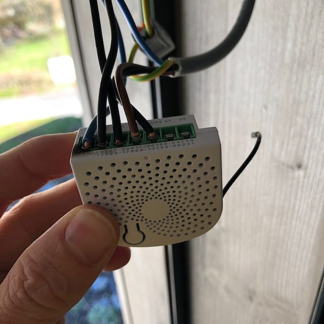
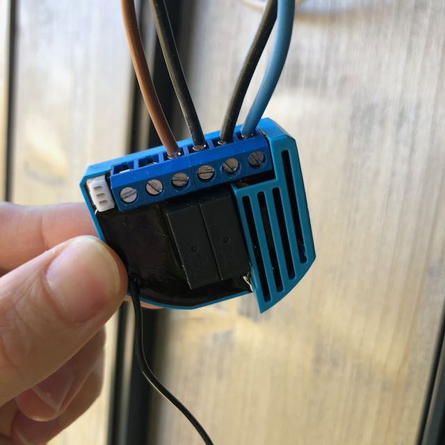
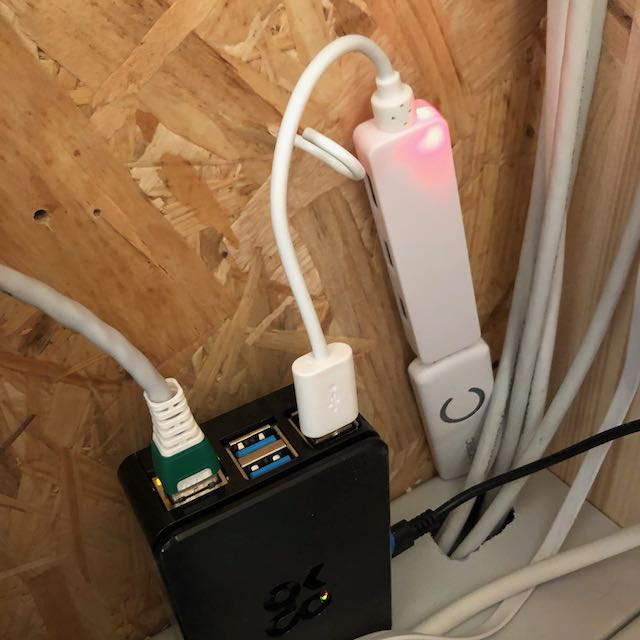

There are two approaches to automating window blinds:

- Using existing, proven systems like [Somfy](https://www.somfysystems.com).
- Vastly overestimating your engineering capabilities and building your own DIY system.

Let's focus on the latter as the former is ridiculous.

There are three main components to this:

1. Remotes to control the whole thing. Usually hand-held ones or special wall switches.
2. A hub / control center / base station relaying these commands to the receivers. This is optional in case the remotes are capable of interacting with the receivers directly.
3. Radio controllers receiving these commands to manage the blinds' power supply.

Being a devoted member of the Apple cult, using a [Homekit](https://en.m.wikipedia.org/wiki/HomeKit)-compatible setup was an obvious choice. This would allow us to use our existing devices instead of having to buy remotes which are a) often limited in how many blinds they can control and b) rather expensive. And not from Apple.

For the radio setup, I decided on the [Z-Wave](https://en.wikipedia.org/wiki/Z-Wave) protocol since the ecosystem of both hardware and open-source software seems vibrant. I went out (just kidding, I never left my desk) and bought the following Z-Wave-compatible radio controllers:

| [Aeotec Nano Shutter](https://aeotec.com/z-wave-motor-shutter-curtain-control/) | [Fibaro Roller Shutter 3](https://www.fibaro.com/en/products/smart-roller-shutter/) | [Qubino Flush Shutter](https://qubino.com/products/flush-shutter/) |
| ------------------------------------------------------------------------------- | ----------------------------------------------------------------------------------- | ------------------------------------------------------------------ |
|                                  |                                  |                    |

<small class="figcaption">
  If you look closely, you can see that the Nano Shutter survived being
  short-circuited for scientific reasons.
</small>

I like the Nano Shutter the best. Mainly because its physical button not only allows you to control Z-Wave inclusion/exclusion (connecting/disconnecting them to the Z-Wave stick), but also to _control_ the blinds. So if somethings goes wrong network-wise, you can still manually close or open the blinds via this button.

To send commands to the controllers, I chose an [Aeotec Z-Stick Gen5](https://aeotec.com/z-wave-usb-stick/) and plugged it into my MacBook. Connecting the controllers to the stick uncovered the first issue with the Qubino one: The [manual](http://manuals-backend.z-wave.info/make.php?lang=en&sku=GOAEZMNHCD1) told me to either `Press push button I1` (which would have required me to connect an external, physical button to this input) or `Press service button S (only applicable for 24 V SELV supply voltage)` (which is a physical button on the controller, however, I was using 220 V). A nice fellow in a [home automation forum](https://www.domoticz.com/forum/viewtopic.php?t=25217) convinced me to use the latter anyway: `In fact 220V also works but you have a risk of electro shock while pressing that stupid S button`.

Still alive and optimistic, I opened my code editor. Being fluent in the only reasonable programming language there is, [JavaScript](https://developer.mozilla.org/en-US/docs/Web/JavaScript), my first attempt was using [Homebridge](https://homebridge.io). I went through every Homebridge-Z-Wave implementation I could find but struggled to consistently send reasonable commands to the controllers. Most of the time, they showed up as light bulbs in Apple's [Home app](https://www.apple.com/ios/home/). Which is not completely unreasonable, but still not ideal.

At some point, I decided to have a look at [Home Assistant](https://www.home-assistant.io), a very well-documented open-source home automation solution. While I was [unsuccessful with the Docker setup](https://github.com/home-assistant/home-assistant.io/pull/12377) and had to jump through [some hoops](https://stackoverflow.com/questions/42098126/mac-osx-python-ssl-sslerror-ssl-certificate-verify-failed-certificate-verify) to run it natively, I was able to connect both the USB stick and the controllers and they properly showed up as window blinds in my Home app. 🎉

After my wife showed a complete lack of understanding for the fact that the blinds would only work if my laptop was up and running, I ordered my first [Raspberry Pi](https://www.raspberrypi.org). This was as much fun as anticipated, definitely recommended. The only thing not immediately obvious to me was that I had to reflash the SD card bundled with [my starter kit](https://www.digitec.ch/en/s1/product/raspberry-pi-4-4g-model-b-full-starter-kit-armv8-development-boards-kits-11764848) with [Raspbian](https://www.raspberrypi.org/downloads/raspbian/) since the default installer apparently requires [connecting a screen and keyboard](https://www.raspberrypi.org/forums/viewtopic.php?t=172862) to the Pi (which I refused).

Everything else was smooth as an android's bottom. That is until I wasn't able to connect the Z-Wave UBS stick. The corresponding [Github issue](https://github.com/raspberrypi/linux/issues/3027) alternatingly blamed Raspberry and Aeotec and stated that the problem was both definitely solved and definitely not solved with every existing USB hub stuck between the Pi and the stick. Luckily, the first cheap hub I found worked out just fine.

<figure>

<figcaption>

Z-Wave stick connected to Raspberry Pi via simple HAMA USB hub.

</figcaption>

</figure>

The only thing left was configuring Home Assistant. Which was a great experience. A very intuitive UI (which I can't say for paid alternatives like [this one](https://www.indigodomo.com/)) and, again, really well-documented. After discovering that the Nano Shutter did not consistently show up in Home after restarting the Pi, a quick search through their Github issues relevaled that [delaying the start of the Homekit integration](https://github.com/home-assistant/core/issues/20032) solved the issue.

So this is my life now:

> Hey Siri, please open the blinds. I want to check the weather to see which pair of sweatpants I should wear for lunch.
