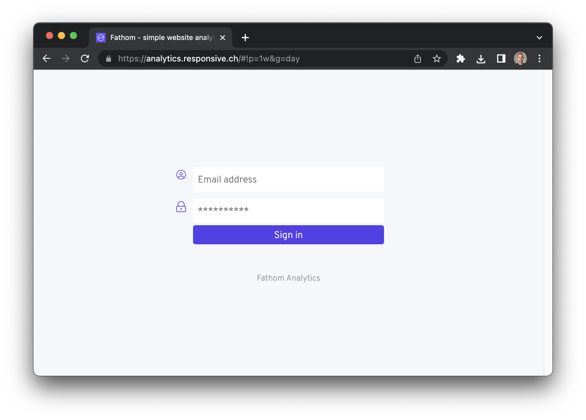

As I'm interested in the number of visitors my own websites are seeing, I need some basic analytics tooling. By setting up my own instance of [Fathom Lite](https://github.com/usefathom/fathom), the open-source version of [Fathom Analytics](https://usefathom.com/), I think I can do this in a fairly privacy-preserving way.

Fathom Lite offers a [pre-built Docker image](https://hub.docker.com/r/usefathom/fathom/). This is great if you don't enjoy following [installation instructions](https://github.com/usefathom/fathom/blob/master/docs/Installation%20instructions.md) consisting of more than one bullet point.

But where to deploy this image? While being able to use AWS, Azure and Google Cloud in my client projects, I try to avoid them whenever possible. As I'm not really experienced with any of their Configuration as Code solutions, deploying a Docker image and assigning a custom domain would include 25 steps in either of their fun admin UIs.

Meet [Fly.io](https://fly.io):

> Fly.io runs apps close to users. We transmogrify Docker containers into Firecracker micro-VMs that run on our hardware around the world, and connect all of them to a global Anycast network that picks up requests from around the world and routes them to the nearest VM.

They had me at transmogrify. But what I actually like the most about it: Deploying an image like the Fathom one takes about a minute (assuming [flyctl](https://fly.io/docs/hands-on/install-flyctl/) has been installed and your are [logged in](https://fly.io/docs/getting-started/log-in-to-fly/)).

### Basic setup

1.  Create the application:

    ```sh
    flyctl launch --image usefathom/fathom
    ```

    This will prompt us for a name and a region. The result is a configuration file with the following content:

    <details>
      <summary>fly.toml</summary>
      ```
      app = "APPLICATION_NAME"
      kill_signal = "SIGINT"
      kill_timeout = 5
      processes = []

    [build]
    image = "usefathom/fathom"

    [env]

    [experimental]
    allowed_public_ports = []
    auto_rollback = true

    [[services]]
    http_checks = []
    internal_port = 8080
    processes = ["app"]
    protocol = "tcp"
    script_checks = []
    [services.concurrency]
    hard_limit = 25
    soft_limit = 20
    type = "connections"

          [[services.ports]]
            force_https = true
            handlers = ["http"]
            port = 80

          [[services.ports]]
            handlers = ["tls", "http"]
            port = 443

          [[services.tcp_checks]]
            grace_period = "1s"
            interval = "15s"
            restart_limit = 0
            timeout = "2s"
        ```

      </details>

2.  Deploy the application:

    ```sh
    flyctl deploy
    ```

    We can access it via `APPLICATION_NAME.fly.io`.

3.  Now we want to assign a custom domain. We do that by adding a `CNAME` record to the domain with a value of `APPLICATION_NAME.fly.io` [^1] and then creating a certificate:

    ```sh
    flyctl certs create CUSTOM_DOMAIN
    ```

4.  Time to bring out the champagne: Our Docker image is deployed to our custom domain.


### Configuration

As we don't want our analytics data to be public (everyone would be jealous of our dozens of visitors per year), we need to [create an admin user](https://github.com/usefathom/fathom/blob/master/docs/Installation%20instructions.md#register-your-admin-user) in Fathom. To do this, we connect via SSH and execute their script:

```sh
flyctl ssh console
> cd /app
> ./fathom user add --email="EMAIL" --password="PASSWORD"
```

Now we will be greeted with a login when accessing Fathom:



### Data persistence

Our current setup has a tiny issue: The analytics data is not persistent. By default, the Fathom Lite image creates an SQLite database in `/app/fathom.db`. So whenever the app is redeployed, we lose our data. But instead of hooking up a [MySQL or Postgres database](https://github.com/usefathom/fathom/blob/master/docs/Configuration.md#accepted-values--defaults), we'll just make the SQLite database is (semi-)persistent. Fly.io has a great solution for this: [Volumes](https://fly.io/docs/reference/volumes/).

1. Let's create a volume in the same region where we set up our app [^2]:

   ```sh
   fly volumes create fathom_data --region REGION --size 1
   ```

2. Mount the volume into our image by adding the following lines to `fly.toml`:
   ```toml
   [mounts]
     source = "fathom_data"
     destination = "/app-temp"
   ```
3. Redeploy:

   ```sh
   flyctl deploy
   ```

4. Copy everything from `/app` to `/app-temp`:

   ```bash
   flyctl ssh console
   > cp -R /app/. /app-temp
   ```

   This will copy the `fathom` executable and the `fathom.db` SQLite database to our mounted volume.

5. Change the mounting destination in `fly.toml`:
   ```toml
   [mounts]
     source = "fathom_data"
     destination = "/app"
   ```
6. Redeploy:

   ```sh
   flyctl deploy
   ```

That's it! Our data will live through redeployments.

### Download database

Now the "semi" part of (semi-)persistent is _really_ important. As written in their [announcement](https://fly.io/blog/persistent-storage-and-fast-remote-builds/):

> Right now, for raw Fly volumes, resilience is your problem. There! I said it!

There are [snapshots](https://fly.io/docs/reference/volumes/#snapshots-and-restores) from the last five days. As I don't care too much about my analytics data, I can live with this level of resilience. But I might create the occasional offline backup.

To back up something from our volume, we use `scp` or a GUI like [Transmit](https://panic.com/transmit/). If you are like me and did not read the [WireGuard manual](https://fly.io/docs/reference/private-networking/#private-network-vpn), you might want do this via a proxy:

1. Issue SSH credentials and create the proxy:

   ```
   flyctl ssh issue --agent
   flyctl proxy 10022:22
   ```

2. Download SQLite database:

   ```
   scp -P 10022 root@localhost:/app/fathom.db .
   ```

Now we are prepared for the [occasional data loss](https://community.fly.io/t/cant-load-site-anymore/8639).


### Pricing

Fly.io's [free plan](https://fly.io/docs/about/pricing/#free-allowances) has got us covered here.

### Random notes

- I ❤️ Fly.io. If an app requires more than what [Vercel](https://vercel.com) offers, I deploy it to Fly. They offer a great service and have a refreshing way of doing [marketing](https://fly.io/blog/) and [recruiting](https://fly.io/docs/hiring/hiring/).
- I'm using their most basic functionality only. See [docs](https://fly.io/docs/) for all the fancy things they can do.
- Their [community Discourse](https://community.fly.io) is helpful. It is often the best way to find specific information as the documentation does not cover everything. Specific example: I could not find documentation on how to download data from a volume, but reading through a few Discourse posts helped me figure it out at some point. _Important_: Don't forget to write how much you like DNSSEC and mention [thomas](https://community.fly.io/u/thomas/), this will give you priority support.

<br />
<small>
  Photo credits: [FX
  Networks](https://www.fxnetworks.com/shows/its-always-sunny-in-philadelphia) and [Yarn](https://www.getyarn.io/yarn-clip/6bcc1af5-1f8d-4131-8cfc-e429cbcdb5ad/gif).
</small>

[^1]: See details and alternatives to CNAME in the [documentation](https://fly.io/docs/app-guides/custom-domains-with-fly/).
[^2]: In case you forgot: Use `flyctl status` or the Fly.io admin UI to find the region your app is currently deployed in.
