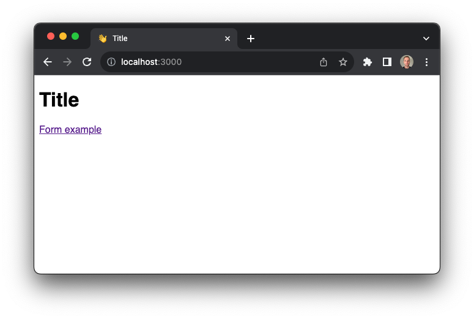
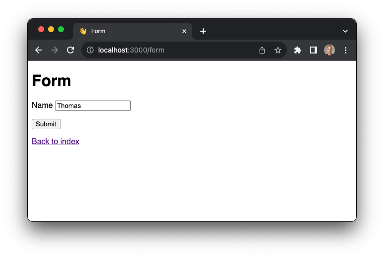
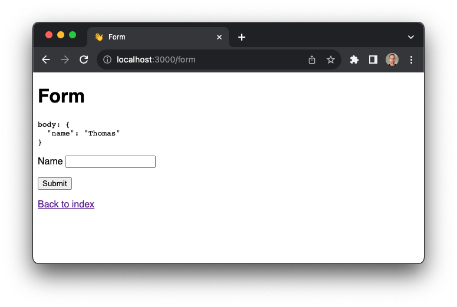

I absolutely love building small web applications.

We have to scroll too long to find our son's favorite kind of bedtime stories on [srf.ch](https://www.srf.ch/play/tv/sendung/guetnachtgschichtli?id=c522b312-1f70-0001-f1f0-817c12301734)? Let's extract them and create our own listing where we can keep track of what we have watched, too.

I'm annoyed with the local library's (single-page) application because it takes 25 clicks to see the books we have borrowed? Let's write a Puppeteer script to export them on an a regular basis and list them on a website along with the current opening hours.

My basic requirements for these mini-projects:

- Routing
- POST request body parsing
- Watch mode during development

In the old days, I would usually opt for something like [Next.js](https://nextjs.org). And whenever I wanted to change something later, I had to spend much more time maintaining dependencies than actually writing code.

My new setup:

```json
"dependencies": {},
"devDependencies": {}
```

## What it does

The demo app has two routes, one of them handling POST requests (assuming the `x-www-form-urlencoded` content type of a basic `<form method="POST">`):

- `GET /`: 
- `GET /form`: 
- `POST /form`: 

## What we need

This is the complete code:

```js
// @ts-check
import http from "node:http";

const port = process.env.PORT || 3000;

/**
 * Parse POST request body
 * @param {import('http').IncomingMessage} req
 * @returns {Promise<{ [key: string]: string | string[] }>}
 */
async function parseBody(req) {
  const body = await new Promise((resolve) => {
    let data = [];

    req
      .on("data", (chunk) => {
        data.push(chunk);
      })
      .on("end", () => {
        const str = Buffer.concat(data).toString();
        const searchParams = new URLSearchParams(str);
        const obj = {};

        for (const key of searchParams.keys()) {
          const values = searchParams.getAll(key);

          obj[key] = values.length > 1 ? values : values[0];
        }

        return resolve(obj);
      });
  });

  return body;
}

/**
 * Render HTML document
 * @param {{ title?: string, content?: string }} props
 * @returns {string}
 */
function renderHtml({ title = "Title", content = "Content" } = {}) {
  return `<!DOCTYPE html>
		<html lang="en">
			<head>
				<meta charset="utf-8">
				<title>${title}</title>
				<style>body { font-family: sans-serif; }</style>
				<link rel="icon" href="data:image/svg+xml,<svg xmlns=%22http://www.w3.org/2000/svg%22 viewBox=%220 0 100 100%22><text y=%22.9em%22 font-size=%2290%22>👋</text></svg>">
			</head>
			<body>
				<h1>${title}</h1>
				${content}
			</body>
		</html>
	`;
}

/**
 * Start server on `port`
 */
http
  .createServer(async (req, res) => {
    const requestUrl = new URL(req.url || "", `http://${req.headers.host}`);

    // Route: `/`
    if (requestUrl.pathname === "/") {
      const html = renderHtml({
        content: `<p><a href="/form">Form example</a></p>`,
      });

      res.writeHead(200, { "Content-Type": "text/html" });
      res.end(html);

      return;
    }

    // Route: `/form`
    if (requestUrl.pathname === "/form") {
      let message = "";

      if (req.method === "POST") {
        const body = await parseBody(req);

        message = `<pre>body: ${JSON.stringify(body, null, "  ")}</pre>`;
      }

      const html = renderHtml({
        title: "Form",
        content: `${message}
					<form action="" method="POST">
						<p>
							<label for="name">Name</label>
							<input type="text" name="name" id="name">
						</p>
						<button type="submit">Submit</button>
					</form>
					<p><a href="/">Back to index</a></p>
				`,
      });

      res.writeHead(200, { "Content-Type": "text/html" });
      res.end(html);

      return;
    }
  })
  .listen(port, () => {
    console.log(`App is running on port ${port}: http://localhost:${port}`);
  });
```

The most complex part of it is parsing the request body (`function parseBody`). It would be even shorter if we ignored multiple values with the same key.

And this is the complete `package.json`:

```json
{
  "name": "my-little-wep-app",
  "version": "0.0.1",
  "type": "module",
  "scripts": {
    "start": "node index.js",
    "dev": "node --watch index.js"
  },
  "engines": {
    "node": ">= 18.11"
  }
}
```

`npm run dev` will restart the server on changes to `index.js` or any of its potential imports. This is courtesy of Node.js `18.11+`' [native file watcher](https://nodejs.org/dist/latest-v20.x/docs/api/cli.html#--watch).

I will never go back.
