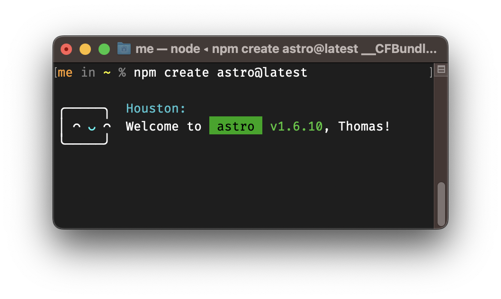

Blogs are great. They are my main source of (tech) information and I very much enjoy following people like [Jim Nielsen](https://blog.jim-nielsen.com), [Dave Rupert](https://daverupert.com) or [Simon Willison](https://simonwillison.net). Their feeds have a cozy home in my [RSS reader](https://reederapp.com).

When I decided to do more writing of my own, the first step was crystal clear: Replace the underlying framework of this blog so the actual writing part can be postponed.

As a responsible web developer, I'm obligated to spend at least 75% of my time evaluating new web frameworks. And there is no better way to do this than using them on ~~important customer~~ personal projects. When setting this blog up two years ago, [Gastby](https://www.gatsbyjs.com) was shiny. It worked out fine and I learned the basics about the framework. (What I took away from it was that it felt a bit over-engineered.)

Getting back to it after more than a year and on a computer with a different processor architecture, I was obviously unable to run `npm install` without a few cheeky errors and warnings. As upgrading to the latest version would have meant following [three](https://www.gatsbyjs.com/docs/reference/release-notes/migrating-from-v2-to-v3/) [different](https://www.gatsbyjs.com/docs/reference/release-notes/migrating-source-plugin-from-v3-to-v4/) [migration guides](https://www.gatsbyjs.com/docs/reference/release-notes/migrating-from-v4-to-v5/) in sequence, I just picked up a new shiny object: [Astro](https://astro.build).

I had been closely following Astro's development and very much sympathized with its general philosophy:

> [...] cover a wide range of styles in the noise field, from space music to psychedelically-tinged harsh noise

Never mind, [wrong Astro](<https://en.wikipedia.org/wiki/Astro_(Japanese_band)>). This one here:

> Zero JavaScript Runtime. Astro renders HTML on the server and strips away any remaining, unused JavaScript.

Now you might think this is irrelevant for a blog with zero client-side JavaScript to begin with. Great thinking! However, there are frameworks whose main purpose is to generate JavaScript out of no JavaScript so they can send it to the visitors of your website because they hopefully are JavaScript afficionados, too.

### My Astro Takeaways

1. It's fun! Even the installation process, thanks to [Nate Moore](https://twitter.com/n_moore/status/1567164215307149312)'s great work. [^1]
   .screenshot
2. There are less dependencies:
   - `node_modules` before: `479.8 MB for 59'083 items`
   - `node_modules` after: `242.1 MB for 10'110 items`

   As everything below 250 MB does not count as a real node_modules folder by law, we basically have no dependencies.

3. I'm missing the possibility to add the complete post to the [RSS feed](/rss.xml) (currently a limitation of [using MDX](https://github.com/withastro/astro/pull/5366#pullrequestreview-1179439896)).
4. The community is really welcoming. When I [opened a PR](https://github.com/withastro/astro/pull/5427) to add support for footnote customizations in Astro's MDX integration, [Sarah Rainsberger](https://www.rainsberger.ca/) and [Ben Holmes](https://bholmes.dev) [^2] were very helpful and kind.

### Further reading

- One of Astro's main strengths is dealing with any kind of client-side JavaScript framework in a performant way. See the [introduction post](https://astro.build/blog/introducing-astro/) from last year and the current [Astro Island documentation](https://docs.astro.build/en/concepts/islands/) for details.
- Taking this further, Fernando Doglio's [article](https://blog.bitsrc.io/playing-with-astro-sharing-state-between-react-and-vue-components-2d5abc89f4b4) demonstrates a way of sharing state between island components written in different frameworks.

[^1]: We were lucky enough to have Nate speak at this year's [Front Conference](https://frontconference.com/speakers/nate-moore) in Zürich. Turns out he knows more about the city's fountains than every living resident.

[^2]: Ben came up with a _really_ fun way to present tech topics on a whiteboard, check out [#WhiteboardtheWeb videos](https://wtw.dev/)!
