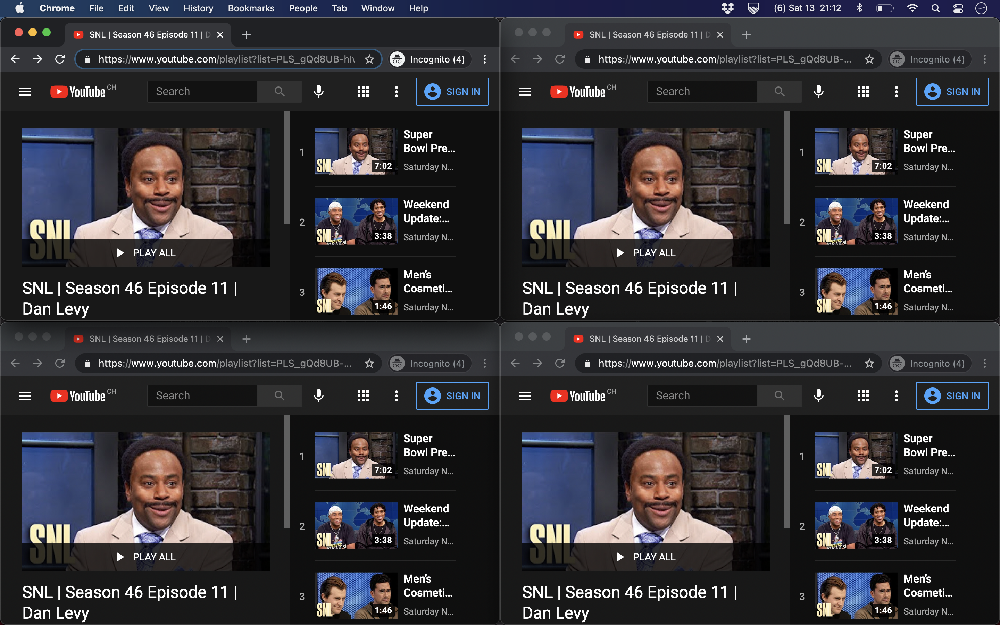

First thing I do is some login screen gardening: Displaying my best self-portrait and [adding contact information](https://support.apple.com/en-bn/guide/mac-help/mh35890/mac). This way, I don't have to remember taking my MacBook with me when leaving the coffee shop.

The first app I install is [1Password](https://1password.com). It allows me to log into Github to download my `.zshrc`, `.gitconfig` and other preference files. Like the cool kids, I started out with a setup script. However, I always forgot to maintain it and ended up with outdated preferences. Now, I just push the system and application preferences I care about (e.g. `com.apple.dock.plist`) to Github right before setting up a new machine.

At some point I realize I have to install the [Xcode Command Line Tools](https://developer.apple.com/xcode/features/#:~:text=Command%20Line%20Tools) for Git to work. Depending on whether I update macOS sometime in between, I'm doing this multiple times as Apple pretends to lose them with every new version. Note to self: `xcode-select --reset` will usually be a quicker solution than the often recommended deleting an re-installing.

The second app I can't live without is [Alfred](https://www.alfredapp.com). Highly recommended by Batman, Alfred not only helps me launching applications, but also remembering my [clipboard history](https://www.alfredapp.com/help/features/clipboard/), showing [my current IP](https://github.com/jeppestaerk/alfred-show-network-info) or finding [processes to kill](https://github.com/SamVerschueren/alfred-fkill). A typical workflow while writing frontend code:

1. Opening the docs for a specific feature in [Dash](https://kapeli.com/dash):

   

2. Checking its [browser support](https://github.com/willfarrell/alfred-caniuse-workflow):

   

3. Finding a polyfill on [npm](https://github.com/sindresorhus/alfred-npms):

   

The third one is [Rectangle](https://rectangleapp.com). It is used by [fellow CEOs](https://github.com/rxhanson/Rectangle/commits/master?before=57ac4a51bbb3cd0250f6bbf1d0e23573a2e6dd80+35&branch=master) and allows me to move around windows via keyboard (or mouse). When working on a widescreen display, I usually want to have two windows next to eachother. So whenever I open an app, I press <kbd>^⌥←</kbd> or <kbd>^⌥→</kbd> to use one or the other screen half. Another important use-case is catching up with SNL in an efficient way:

Moving on to the menu bar, I use [Dato](https://sindresorhus.com/dato) to display the current week number and have immediate access to the calendar. As you can see, I'm very good at calendaring:

The other menu bar app I approve of is [Lungo](https://sindresorhus.com/lungo). Why should your Mac be able to sleep when you can't?

After having installed [Docker](https://www.docker.com), [Homebrew](https://brew.sh) and [nvm](https://github.com/nvm-sh/nvm), it's time for some atypically large [electrons](https://www.electronjs.org): [VS Code](https://code.visualstudio.com), [Slack](https://slack.com) and [Notion](https://www.notion.so) are the applications I spend most of my screen time in. I very much enjoy the fact that they are written in JavaScript. While, like any reasonable Swiss citizen, I have mixed feelings about some of them being developed in [Zürich](https://channel9.msdn.com/Events/TechDays/TechDays16Baden/Keynote-1-Visual-Studio-Code-made-in-Switzerland).

Last thing to do is setting up [Arq](https://www.arqbackup.com) to back up my files into a [glacier](https://aws.amazon.com/glacier/), and installing [Dropbox](https://www.dropbox.com) to gain access to everything not living in a Git repository.
